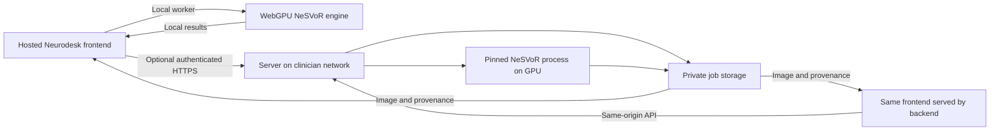
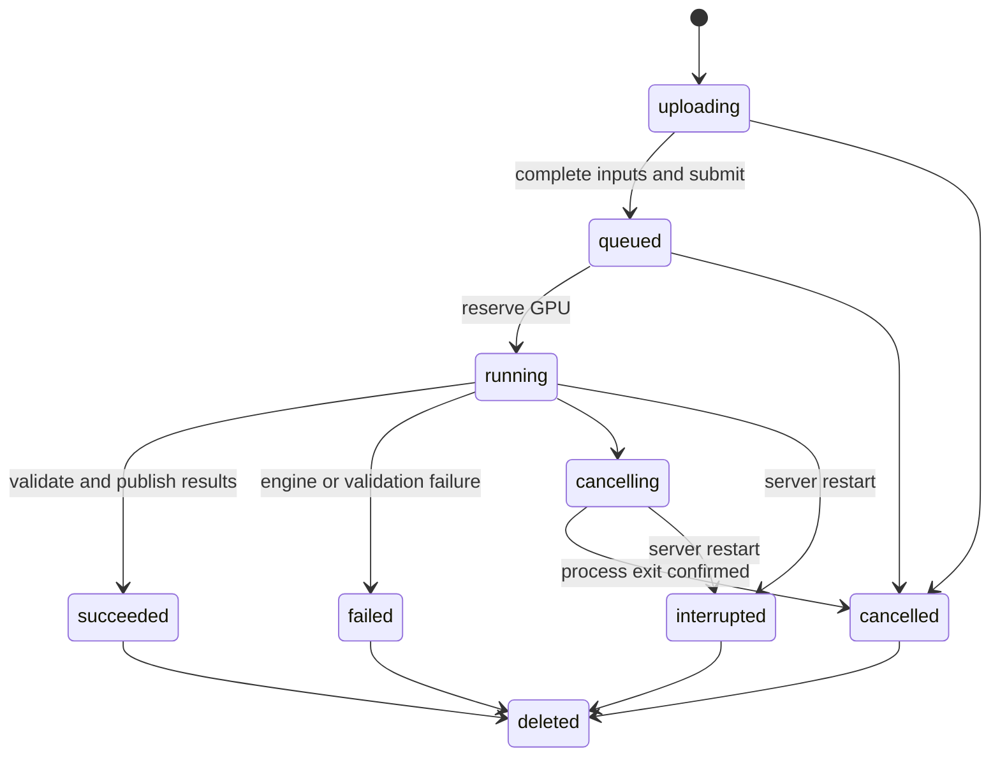

# NeSVoR browser reconstruction and optional remote processing

Design analysis, 21 September 2026. Proposed interfaces and paths below are not implemented APIs.
The companion [research](nesvor-research.md) records upstream evidence. The [work record](nesvor-design-status.md) tracks this design phase.

## Recommendation

Build the familiar Neurodesk imaging workspace with two required execution modes: reconstruction inside the browser using WebGPU, and optional reconstruction on a Linux/NVIDIA backend selected by the clinician. Both belong to this port and must pass scientific acceptance before the port is complete. Ship the same frontend with the backend so a site can operate without the public website or internet access.

Keep remote processing a shared capability that other apps can adopt. NeSVoR owns one scientific request and result contract with browser and native implementations. The shared remote capability owns authentication, transfers, durable jobs and results. Existing apps continue to use their current local engines unless explicitly adapted.

The user confirmed Linux with an NVIDIA GPU as the first downloadable backend target, required browser-native reconstruction as part of this port, and requested design review before implementation. The backend initially targets x86_64, matching the container recipe. Browser compute has its own WebGPU hardware/browser support matrix and is not restricted to Linux/NVIDIA. Native CPU, Windows and macOS server distributions require separate support decisions. Upstream CPU fallback code is not proof of practical operation on those targets.

The initial scientific workflow is multi-stack fetal brain MRI reconstruction. It is not a generic super-resolution filter for a single T1 volume. NeSVoR trains a neural representation for each case. Browser scope includes registration, training, custom operations and volume sampling. It must run the complete selected preset locally without a server. The pinned container remains the numerical reference and remote engine. See the [browser implementation design](nesvor-browser-design.md) for the required port and acceptance gates.

## What the repository already provides

The actual integration path is:

1. `scripts/new-app.mjs` copies `templates/app-template` and creates app, example and distribution records.
2. `mountImagingWorkspace()` connects the app to the shared shell. `site/app-shell.js` supplies the application bar and registry-backed information.
3. `readImageFiles()` in `packages/runtime-support/src/dcm2niix-client/index.ts` keeps NIfTI inputs and converts DICOM series locally. NeSVoR retains all selected stacks rather than applying a single-image restriction.
4. Existing apps such as Greedy send inputs to a scientific worker, receive progress and wrap results as files. NeSVoR uses that pattern for browser computation and a durable job for remote computation, behind one scientific contract.
5. `createResultList()`, the shared download helper and NiiVue display and export the returned images.

Use the [design system](design-system.md) and [interface standard](interface-standard.md) without app-specific replacements for sidebar, toolbar, console, status or dialogs. About and method citations belong in `registry/app-information.yml`.

Remote execution changes several existing assumptions:

| Existing contract | Required change |
| --- | --- |
| Template Privacy says files are never uploaded | Keep that promise for browser mode; show destination and retention when the user explicitly chooses remote processing |
| Worker termination stops local work | Separate disconnect, cancel computation and delete server data |
| Desktop host serves static files on loopback | Add a separate compute service; do not expose that static host as a LAN job server |
| Desktop blocks external requests and resolves HTTPS only from its asset lock | Add an explicit, scoped remote connection mode with certificate verification |
| Standalone catalog supports desktop, CLI, container and model artifacts | Add a server distribution kind with requirements and verified downloads |
| Every desktop app must execute an offline scientific workflow | Preserve standalone browser-engine coverage and add separate packaged remote-backend coverage |

The design-system document explains why shared controls are mandatory. The desktop architecture explains why complete asset locks and real offline workflows are mandatory. These are explicit repository constraints, not inferred preferences. Local history includes the standalone rollout `d9de1eb`, shared model pack `bbf0d46`, release decoupling `50e6858`, and example standardization `8828d19`. External team discussions and operational telemetry were not available in this review.

## Clinician workflow

The app opens with Input and Reconstruction sections, the viewer, and a single status line. The input section offers one suitable example before the file picker. There is one primary action, **Reconstruct volume**.

1. Select NIfTI stacks or a DICOM folder. Conversion and initial viewing happen on the client. List the resulting series so the user chooses the intended stacks.
2. Inspect stacks, include or exclude them, associate one reviewed fetal-brain mask with each included stack, and confirm physical slice thickness in millimetres. A slice gap or NIfTI voxel spacing is not automatically the acquisition thickness. When thickness is inferred, show a non-blocking note and allow editing; do not require acknowledgement. Preserve orientation, affine, units and per-stack identity.
3. In Reconstruction, choose **In this browser** or **On a network server**. Browser mode is the default where the complete preset passes capability checks. Remote mode reveals **Processing server**, with IP/hostname and pairing code. Installation and backend downloads are in the shell's Standalone dialog. A capability failure explains the limit and offers the alternative without selecting it or uploading anything.
4. Review output resolution and the processing destination. Expand Advanced settings only for less common scientific choices. Unsupported methods are unavailable with an explanation from backend capabilities.
5. Select **Reconstruct volume**. Browser mode performs all processing locally; remote mode sends the selected bundle to the named server. Merely connecting, importing files, or choosing an example does not upload patient images. A local memory or device failure must never trigger automatic remote execution.
6. Keep inspecting input images during computation. Both modes show scientific stage and elapsed time. Remote mode additionally shows upload bytes and queue state. Use an indeterminate indicator where upstream supplies no defensible percentage.
7. On completion, expand Output. Offer View and Download for the reconstructed NIfTI, plus downloadable provenance and useful supported QC outputs. Validate geometry before overlaying inputs and outputs. No success state may expose stale results from another input revision.

The initial proposed preset requires supplied masks, so keep their controls visible with the stack inputs until complete. Associate each mask explicitly with its stack. Reject missing masks, mismatched geometry and ambiguous associations. Do not silently resample masks. Do not expose arbitrary command-line flags, server paths, shell commands or uploaded Python checkpoints.

The first release should expose the documented reconstruction path, not every upstream subcommand. Additional methods such as classical SVR or resampling a fitted representation need separate controls, citations where applicable, examples and scientific checks. Do not label raw training loss as clinical reconstruction quality.

The proposed preset is **Fetal brain reconstruction with supplied masks**. It runs `reconstruct` with `registration=svort`, `svort-version=v2`, `metric=none`, `filter-method=none`, `background-threshold=0`, 0.8 mm output resolution, 6,000 iterations and recorded seed 0. Segmentation, N4 bias correction, Otsu thresholding and deformable reconstruction are off. The server selects the assigned GPU rather than accepting a device number from the browser. Expose resolution in the task section and iterations in Advanced settings, within backend-enforced resource limits. Keep physical thickness per stack explicit. Final accepted ranges and minimum useful stack coverage come from the reference runs. Do not guess clinical thresholds from file count alone.

Requiring masks is a proposed product restriction, not an upstream requirement. Without masks, upstream keeps positive-intensity tissue, which can include maternal anatomy; it does not automatically invoke fetal segmentation. The first example must include reviewed masks. Automatic fetal segmentation, bias correction and quality-assessment models are later methods, unavailable until their assets and full workflows are verified. In particular, MONAIfbs states that it is not intended for clinical use. Preserve that statement wherever the method is offered. A clinician-oriented interface does not establish clinical validation or change upstream intended use.

SVoRT normally produces atlas-space reconstruction with scanner-space output disabled. Label that output space explicitly. Show inputs and output separately unless a verified transform supports their overlay. The proposed preset follows source behavior and still requires a real baseline run; it is not a validated clinical protocol.

"In this browser" means the complete reconstruction runs in the browser, with no Python process or localhost server. A backend on the same physical workstation remains server mode and uses its explicit address. Execution selection cannot change while a job runs; starting another mode creates a new run with separate provenance and results. Preserve inputs and settings when switching between idle modes.

## Deployment and data flow



Both frontend deployments offer the same browser engine and optional server client. Neither routes images through Neurodesk hosting. The backend ships the frontend as a supported deployment option, not a second UI implementation. Browser mode does not contact a processing server, even when a saved server address exists.

For normal hosted use, the clinician enters an address such as `192.168.10.24:8443`. Normalize a bare address to HTTPS, support bracketed IPv6, and display the complete destination before connecting. Reject URL credentials, query strings, fragments and unsupported schemes. Do not scan the network or follow API redirects to another origin.

An IP address alone cannot establish trusted HTTPS. The administrator supplies a certificate trusted by client devices, with the selected DNS name or IP in its subject alternative names. An institutional reverse proxy is another supported termination point. A self-signed certificate is usable only after an administrator establishes trust on the clients. Browser JavaScript cannot bypass certificate errors or implement its own TLS certificate pinning.

The backend also serves `/nesvor/` and `/api/v1/` at one trusted origin. This removes cross-origin API configuration and the dependency on loading the public frontend. It does not remove the need for HTTPS on a LAN, nor does it magically solve certificate distribution. Loopback development is separate from a LAN deployment. Serve the same isolation headers required by the shared DICOM runtime.

Chrome documents permission-gated local network access and some HTTP mixed-content exceptions. These are browser-specific compatibility facts, not an encrypted transport. The clinical data path uses HTTPS. CORS still applies to cross-origin connections, and managed browser policy can deny local access. Do not promise that enabling CORS makes any private IP reachable. See [Chrome's local network access guidance](https://developer.chrome.com/blog/local-network-access), [MDN local network access](https://developer.mozilla.org/en-US/docs/Web/Security/Defenses/Local_network_access), and [CORS](https://developer.mozilla.org/en-US/docs/Web/HTTP/Guides/CORS).

## Authentication, ownership and retention

Default server startup binds loopback. LAN serving requires an explicit interface, TLS configuration and allowed frontend origins. Pairing requires a short-lived, one-use secret issued on the server, with rate limits and attempt limits. Never place credentials in the page URL, query string, log or analytics event.

Pairing creates a client identity with a revocable credential. Store hashes of credentials on the server and bind credentials to the approved frontend origin. Jobs belong to that identity; opaque job IDs are not authorization. Check ownership on every job, upload, status, log, result and delete request. Two clinicians must not enumerate or fetch one another's cases. A pairing identity is not hospital SSO or a clinical audit identity. Institutional identity integration remains a separate deployment requirement where needed.

Use bearer authorization headers and `credentials: omit` for the shared API, including streamed result downloads. Avoid cookie-based cross-site authentication. Hold access credentials in memory. A reload requires reauthentication to the same identity, with a protected recovery credential explicitly saved by the user or supplied through an administrator-managed identity flow. A new pairing must not inherit other identities' jobs. A recovery credential is a secret and belongs outside URLs and general browser storage.

The server checks the configured Host and Origin, including pairing requests. CORS is an exact allowlist with `Vary: Origin`, explicit methods and headers, and unauthenticated preflight handling. It is not authentication. Validate parsed requests, file sizes, decompressed sizes, image dimensions and disk quotas. Never interpret user filenames as filesystem paths. Spawn a fixed executable with an argument array under an unprivileged account. Prevent traversal and symlink escape, and never expose the Docker socket or an arbitrary process runner to clients.

Proposed retention is deletion 24 hours after a terminal job state, with an administrator-configurable limit and immediate **Delete server data**. Upload drafts expire after one hour of inactivity. These are product defaults to confirm, not upstream behavior. Show the retention rule before upload, the draft expiry during upload, and the actual result expiry after the job becomes terminal. Expiry must also remove derived images, masks, checkpoints and logs; active jobs cannot be swept while running. Retain only minimal non-image audit records under a separate policy. Disk deletion does not establish secure erasure from snapshots or backups. The deployment guide must cover encrypted storage and backup exclusions.

DICOM conversion is not a guarantee of de-identification. NIfTI headers, anatomy and filenames can remain identifying. Use generated server filenames, keep clinical labels out of routine logs, and treat checkpoints as patient data too. The server accepts only uploaded files and locked runtime assets, not user-provided URLs that it could fetch internally.

For this clinical workflow, disable third-party analytics in both deployment forms through shared shell metadata before analytics starts. Do not send server addresses, pairing details, job IDs or patient labels through page URLs. The current shared analytics module deliberately has no custom-event API, but page-view collection is still unnecessary here. The backend-hosted bundle resolves all scripts, fonts, models and examples locally.

## Remote job lifecycle and transport

The server owns the authoritative state. A disconnected browser does not cancel computation.



Expired drafts are deleted. Terminal jobs can be deleted or expire. A retry after failure or interruption creates a new job linked to the old one. Never silently resume an optimizer from an arbitrary intermediate file. Restart recovery may preserve queued jobs, but only after rechecking complete inputs and runtime availability. Do not mark a job cancelled until its process group has exited and released GPU resources.

Use a single service process with SQLite transactions and per-job directories initially. One scheduler owns the queue and permits one active job per configured GPU. Do not run multiple independent API workers over an in-memory scheduler. Bound queue length, storage and job duration; return actionable resource errors. Record process ownership so service restart cannot leave an old GPU child running while launching a replacement.

Start with authenticated HTTP requests and status polling with backoff. A monotonically increasing job revision detects changes. This avoids introducing WebSockets or streaming event infrastructure for one queued reconstruction. Logs have a bounded cursor and are separate from status. The API can later support an event stream without changing the app's scientific interface.

Uploads are resumable fixed-size chunks using opaque file IDs, chunk offsets and hashes. The server validates each chunk, records acknowledged offsets and commits complete files only after size and digest verification. Repeating the same chunk is harmless; different bytes at the same offset are a conflict. A final submit transaction verifies every input and locks the job specification. No worker starts against a partial upload.

Creating a draft uses a client-generated idempotency key scoped to its owner. Repeating a key with the same specification returns the same job; a different specification is a conflict. A lost response must not duplicate GPU work. A restored tab retrieves job state before offering retry. Input replacement increments a local revision and detaches the current view from previous results; it does not silently cancel an existing remote job.

Download endpoints support authenticated byte ranges and stable checksums. Return files from the completed result manifest only, never arbitrary paths. Partial output is not a successful result. The client can retry a download without resubmitting reconstruction. Bound browser memory and avoid loading every full-resolution stack at once. Large optional checkpoints remain server-side unless explicitly downloaded.

The provenance manifest records the ordered input hashes and confirmed thicknesses, masks, effective parameters, random seed, software and model hashes, GPU/driver information, timings and warnings. It omits patient names and original filenames by default. The adapter stages outputs privately, validates their headers and content, publishes an immutable manifest, then commits success. Startup reconciliation removes uncommitted staged outputs and never infers success from a file merely existing.

## Proposed module boundaries

All new paths in this table are proposals. Existing owners are retained.

| Owner | Responsibility |
| --- | --- |
| `apps/nesvor` | Generated workspace, stack review, scientific settings, viewer, results and explicit privacy wording |
| `packages/nesvor` | Shared scientific specification, browser worker, WebGPU training and registration, volume sampling, provenance; no HTTP |
| `packages/remote-compute` | Connection, identity, version negotiation, transfer, reconnect, polling, cancellation and download client |
| `packages/components` | Shared processing-server control and server download rendering, using existing classes and dialog builders |
| `packages/compute-protocol` | Versioned wire schema, generated types and cross-language contract fixtures |
| `services/compute-server` | Python HTTP service, authentication, SQLite job state, file storage and process supervision |
| `services/compute-server/engines/nesvor.py` | Validated NeSVoR specification to fixed argv, pinned runtime execution, stage reporting and output validation |
| Existing release scripts, registry and desktop package | Server distribution records, execution requirements, packaging and explicitly permitted remote connections |

Use `services/` for the Python server rather than repurposing `exes/`, whose documented contract is native Rust executables. The API service and each CUDA job run in separate processes. Package a locked Python HTTP stack with the service; importing the HTTP service must not initialize CUDA. No generic plugin loader or arbitrary workflow language is needed for one engine.

The protocol schema defines wire payloads once; generate TypeScript and Python validation models and test them against shared fixtures. Both engines consume the same versioned scientific specification, while transport envelopes remain remote-only. Domain types below describe what app code uses. HTTP details remain inside the remote client.

### Caller usage

The [browser design](nesvor-browser-design.md#caller-usage-and-ownership) defines the shared, request-bound execution interface for both modes. The pseudocode below illustrates the underlying remote client, not working imports or the app's mode-selection API:

```js
const connection = await connectProcessingServer({ address, pairingCode });
const request = prepareReconstruction({ stacks, masks, settings });
const job = await connection.submit(request, {
    onReceipt: saveNonSecretReceipt,
    onTransfer,
    signal
});
await job.observe(renderJobState, { signal: observationSignal });
const image = await job.download("reconstruction", { signal });
```

`submit` hides draft creation, retry identity, upload and finalization. It awaits `onReceipt` immediately after draft creation and before uploading or finalizing, so the caller can durably save non-secret recovery metadata. Aborting a submit stops client transfer; it does not imply that an already accepted job was cancelled. The client resolves ambiguous finalization by fetching that receipt's state.

```js
const job = await connection.reopen(receipt);
await job.cancel();
await job.waitForTerminal();
await job.deleteData();
```

Observation cancellation only stops polling. `cancel()` requests process cancellation. `deleteData()` accepts terminal jobs only and returns a conflict for active jobs. A UI action can explicitly cancel, wait for confirmed process exit, then delete. Keep an owner-scoped tombstone without patient metadata until the identity's retry window expires, so repeating a deletion after a lost response is safe. These operations must remain distinct in the UI.

### Domain shape

The implementation derives wire types from the protocol schema; this notation illustrates invariants:

```text
ReconstructionRequest = {
    method: "nesvor.reconstruct",
    inputRevision: InputRevision,
    stacks: NonEmpty<Stack>,
    settings: ValidatedReconstructionSettings
}
Stack = {
    id: StackId,
    image: File,
    thicknessMm: PositiveMillimetres,
    mask: ValidatedMask
}
JobState = Uploading | Queued | Running(stage, progress)
         | Cancelling | Succeeded(resultManifest)
         | Failed(problem) | Interrupted(problem) | Cancelled | Deleted
ConnectionState = Disconnected | Connecting
                | Ready(identity, capabilities) | Unavailable(problem)
JobReceipt = { serverId, ownerId, jobId, inputRevision }
```

Receipts contain no authentication secret. Validate branded identities and scientific quantities at boundaries, not through casts. A successful result manifest exists only in `Succeeded`. Connection failure is not job failure. The server repeats scientific validation because a client is untrusted.

### Wire operations

| Operation | Contract |
| --- | --- |
| `POST /api/v1/pair` | Consume one-use pairing secret and issue scoped credentials |
| `GET /api/v1/capabilities` | Authenticated engine versions, readiness, supported methods, limits, retention and API compatibility |
| `GET /api/v1/jobs` | Paginated jobs belonging to the authenticated owner, with state and applicable expiry information |
| `POST /api/v1/jobs` | Create or recover an upload draft with an idempotency key |
| `PUT /api/v1/jobs/{job}/inputs/{file}/chunks/{offset}` | Bounded, authenticated, repeatable chunk upload |
| `GET /api/v1/jobs/{job}` | State, revision, acknowledged uploads and completed result manifest |
| `POST /api/v1/jobs/{job}/submit` | Atomically validate and queue once |
| `POST /api/v1/jobs/{job}/cancel` | Repeatable cancellation request with authoritative resulting state |
| `GET /api/v1/jobs/{job}/logs?after={cursor}` | Bounded, redacted technical logs |
| `GET /api/v1/jobs/{job}/results/{result}` | Authorized, range-capable result bytes |
| `DELETE /api/v1/jobs/{job}` | Idempotent deletion after process termination |

Credential renewal, recovery and revocation belong to the identity contract and need complete endpoints in the implementation specification. The table is the job contract, not a finished OpenAPI document. Reject incompatible major API versions before uploads. Preserve existing result downloads across compatible upgrades. Record app, protocol, server, engine, model and container versions separately.

## Downloadable backend and desktop integration

A downloadable server must include more than a wrapper executable. The release needs its interpreter, locked dependencies, scientific runtime, compiled extensions, frontend and offline model assets. A host NVIDIA driver is an explicit prerequisite. Build and test on a defined baseline Linux system; publish actual driver, GPU and memory requirements from measured runs rather than inventing a VRAM minimum.

First prove the API against the pinned container, then prove a relocatable Linux archive with a `neurodesk-compute` launcher and bundled runtime. If the Python/CUDA dependency tree cannot be made relocatable, report that result and ship an explicitly container-based option requiring Docker or Apptainer. A Docker command alone does not meet the requested standalone application experience. Do not advertise the archive until an extracted download executes a reconstruction on a clean host without a system Python, compiler or runtime downloads.

Offer an offline OCI or Apptainer distribution alongside the archive for managed sites. Resolve the current image tag to a digest and record the digest. Prebuild CUDA extensions for the supported GPU architectures; do not discover at first clinical use that the package needs a compiler or internet connection. Verify optional registration and segmentation weights, their licenses and the redistribution rights of runtime dependencies.

Proposed launcher operations are `serve`, `doctor`, `pair`, and `verify`. `doctor` checks driver, GPU, asset hashes, storage, runtime loading and a small real operation. `serve` accepts an explicit state directory and, for LAN mode, the bind interface, certificate and allowed origins. The service prints its URL and how to obtain a pairing code. It must not request administrator rights to process a job. An optional system service installation is separate from ordinary startup.

Add `server` to the shared standalone catalog and renderer, with version, platform, checksum, protocol range, engine/runtime identity and hardware requirements. Preserve the existing desktop-suite downloads. An unpublished backend has no download link; generated guesses are not release artifacts. Keep all models and validation datasets outside Git and register approved, pinned Hugging Face assets.

The Electron suite packages the browser engine and its locked registration assets. Local execution remains subject to verified GPU capabilities. Declare both `browser-webgpu` and optional `remote-server` execution requirements rather than making an external server mandatory. Update validators, documentation and workflow tests together. A desktop permission applies only to the user-selected HTTPS origin, authenticated API path and active remote connection. Keep unrelated network requests blocked. The existing HTTPS asset resolver and permission handler both need changes; changing only `onBeforeRequest` is insufficient.

Two offline scientific gates are required. The packaged browser engine completes reconstruction with no processing server and no network access. Separately, the packaged frontend and backend complete reconstruction with internet routes disabled but loopback or the test LAN available. A capability-failure test verifies that unsupported local devices explain their limits without silently changing mode. Do not weaken the suite's general asset allowlist to make one app pass.

## Scientific and release evidence

The container's help test does not establish reconstruction correctness. The first acceptance reference is a real NeSVoR run from the pinned engine with the same inputs and settings. Capture image geometry, output values, runtime, peak GPU memory, seeds and hardware. Optimization can vary across GPU and library versions, so choose numerical tolerances from repeated baseline measurements before testing the adapter. Require spatial alignment and explicit quality criteria, not byte equality alone or an attractive screenshot.

Select an appropriately licensed, de-identified multi-stack fetal dataset. Confirm redistribution before mirroring it at a commit-pinned URL in `neurodeskorg/webapps`. The upstream example's existence does not establish permission to redistribute it. A synthetic bundle can test geometry, transfer and cancellation, but cannot establish fetal reconstruction accuracy. The template's single T1 example is unsuitable.

Validation gates for implementation are:

| Gate | Evidence required |
| --- | --- |
| Reference science | Pinned container and wrapped backend execute the same real case; geometry and agreed numerical/QC criteria pass |
| Browser science | Kernel forward/backward tests, optimizer-step comparisons, full local registration and reconstruction match frozen reference criteria on real fetal stacks; phantom-only or pre-registered input runs are insufficient |
| Inputs | Multi-series DICOM conversion, NIfTI geometry, physical thickness, mask association and malformed-volume handling |
| Transfers and lifecycle | Interrupted chunks, lost responses, duplicate submit, queue limits, browser reconnect, cancellation races, backend restart and deletion |
| Authorization | Wrong origin, invalid Host, expired pairing, revoked credentials, cross-owner job/result access, traversal and hostile sizes are rejected |
| Connectivity | Establish the first supported browser/version matrix with the two-machine spike; test both deployment forms, permission denial and certificate failure. Expand to Chrome, Edge, Firefox and Safari only as those combinations pass |
| Privacy | Browser mode sends no patient data and never contacts a processing server; remote mode contacts only the selected server and approved static/example assets; no clinical labels in telemetry, URLs or routine logs |
| Real download | Extracted server release runs without system Python or downloads; missing driver and missing assets produce actionable diagnostics |
| Offline | Cold packaged browser installation reconstructs without any server or network; separate frontend/backend installation passes with internet access blocked |
| Interface | Fresh `pnpm build`, `pnpm audit:interfaces`, `pnpm test:mobile`, `pnpm test:interface-workflows`, and `pnpm test:image-uploads`; inspect desktop/phone light/dark screenshots |

Mock servers establish UI and protocol behavior only. They cannot replace a CUDA workflow gate. Record when hardware-dependent tests were not run. Update `docs/architecture/interface-audit.md` when adding the app and resolving audit findings. Follow changesets and `pnpm release` for implementation releases, with the required date versions and linked server version synchronization.

## Delivery sequence

1. Resolve source pins, example redistribution and the shared scientific preset. Export reproducible forward, gradient, optimizer and registration fixtures from the pinned reference.
2. Prove the browser's hash-grid gradient accumulation and one full training step, and SVoRT inference plus registration operator coverage. Measure memory before committing to the full implementation shape.
3. Complete local preprocessing, registration, training and volume export on the real fetal example. Pass browser numerical gates against the reference; reduced synthetic demonstrations are intermediate evidence only.
4. In parallel with browser numerical work, prove trusted LAN connectivity and the durable native service on the same example, including transfer, cancel, restart and deletion.
5. Generate `apps/nesvor`, wire both engines to the shared workflow, and test explicit mode selection, failures, privacy and result provenance.
6. Package the offline browser runtime and downloadable Linux/NVIDIA backend, including the backend-hosted frontend and verified catalog entries.
7. Complete both scientific tracks and all interface, privacy, offline and release gates. Remote-only completion does not satisfy this port.

The first browser milestone proves training gradients and local registration feasibility. The integration milestone is the same real input-to-reconstruction-to-download workflow in both modes. No browser capability claim follows from a server run, and no claim of native parity follows from a successful shader compilation.

## Decisions still requiring evidence

Linux/NVIDIA is the agreed initial server target; 24-hour server retention remains a proposed default. Windows/WSL and macOS native servers are not promised. Browser hardware support is a separate matrix. Exact supported GPUs, driver versions, archive relocation and browser training performance require measurement. Example redistribution and optional model redistribution require source license evidence.

The site administrator must choose an institutional certificate/hostname or distribute trust for an IP certificate. This is an unavoidable deployment decision for trusted LAN HTTPS. Multi-user hospital identity and production retention policy also need site input; the initial pairing model must not be presented as SSO.

No runtime implementation or scientific validation is claimed by this design document.
